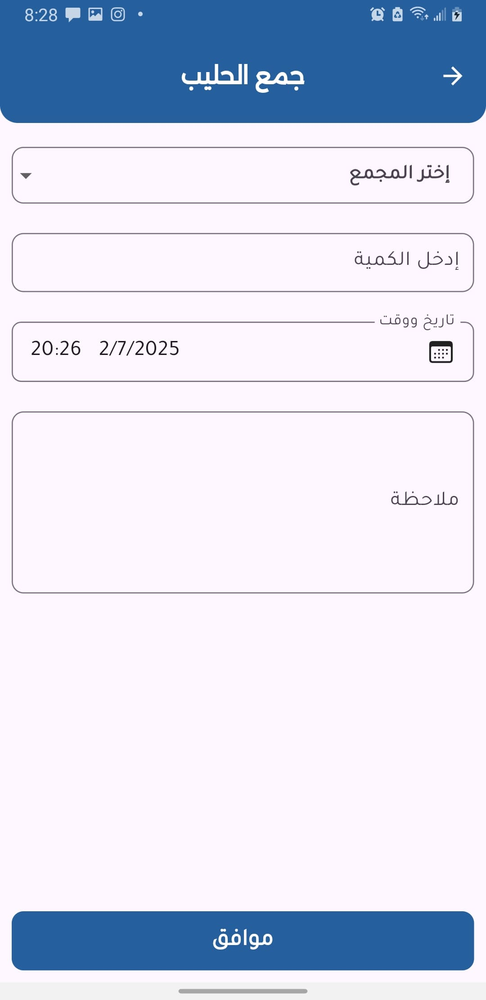
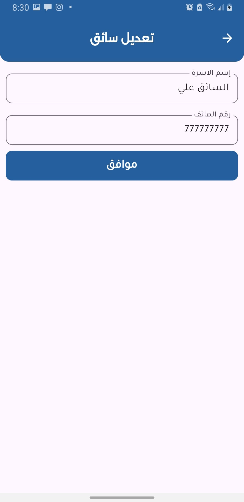
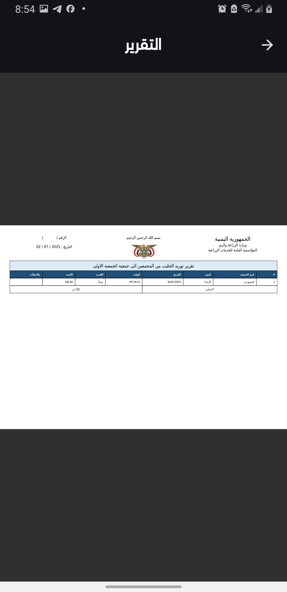
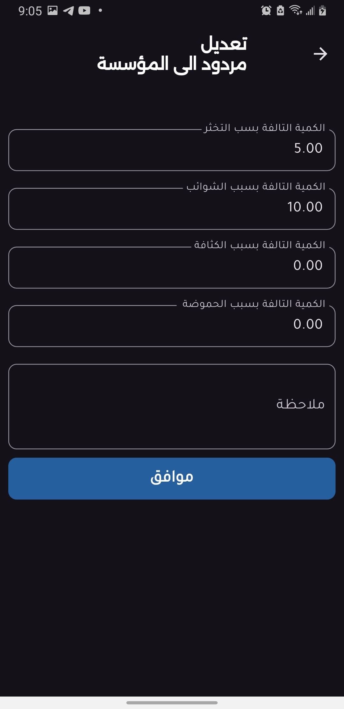
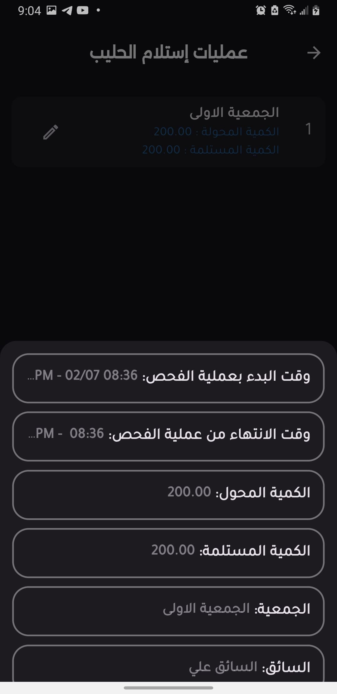

# 🥛 Milk Unit Management System

## 🧩 System Overview

The Milk Unit Management System is a modular solution designed for the Agricultural and Fisheries Committee under the Investment Sector – Information Systems Department. It includes three specialized applications:

- **Milk Unit for Collectors** – Facilitates collection from households and records accurate data.
- **Milk Unit for Association** – Supervises collectors, manages milk flow, and produces detailed reports.
- **Milk Unit for Delegates** – Handles quality inspection of received milk and records returns.

Together, these apps ensure traceability, operational efficiency, and transparency in milk production and delivery.

## 🚀 Core Features Across the System

- ✅ Modular design for different user roles: Association, Collector, Delegate
- ✅ Real-time tracking of milk collection, transfer, and returns
- ✅ Role-specific reporting with exportable summaries
- ✅ Secure login with phone number and password
- ✅ Activity logs and system audit trails
- ✅ Light and Dark Mode support
- ✅ Custom Flutter UI components

## 📱 Application Screenshots

Each app provides light and dark mode screenshots of their specific workflows including:

- Authentication
- Milk collection & inspection
- Household management
- Drivers & collectors management
- Transfer operations
- Reports and activity logs


📷 All screenshots for Collector app.
Light Mode
<table>
<tr>
<td></td>
<td></td>
<td></td>
</tr>
<tr>
<td></td>
<td></td>
<td></td>
</tr>
<tr>
<td></td>
<td></td>
<td></td>
</tr>
<tr>
<td></td>
<td></td>
<td></td>
</tr>
<tr>
<td></td>
<td></td>
<td></td>
</tr>
<tr>
<td></td>
<td></td>
</tr>
</table>

Dark Mode
<table>
<tr>
<td></td>
<td></td>
<td></td>
</tr>
<tr>
<td></td>
<td></td>
<td></td>
</tr>
<tr>
<td></td>
<td></td>
<td></td>
</tr>
<tr>
<td></td>
<td></td>
<td></td>
</tr>
<tr>
<td></td>
<td></td>
<td></td>
</tr>
<tr>
<td></td>
<td></td>
</tr>
</table>

---

📷 All screenshots for Association app.
Light Mode
<table>
<tr>
<td></td>
<td></td>
<td></td>
</tr>
<tr>
<td></td>
<td></td>
<td></td>
</tr>
<tr>
<td></td>
<td></td>
<td></td>
</tr>
<tr>
<td></td>
<td></td>
<td></td>
</tr>
<tr>
<td></td>
<td></td>
<td></td>
</tr>
<tr>
<td></td>
<td></td>
<td></td>
</tr>
<tr>
<td></td>
<td></td>
<td></td>
</tr>
<tr>
<td></td>
<td></td>
<td></td>
</tr>
<tr>
<td></td>
<td></td>
</tr>
</table>

Dark Mode
<table>
<tr>
<td></td>
<td></td>
<td></td>
</tr>
<tr>
<td></td>
<td></td>
<td></td>
</tr>
<tr>
<td></td>
<td></td>
<td></td>
</tr>
<tr>
<td></td>
<td></td>
<td></td>
</tr>
<tr>
<td></td>
<td></td>
<td></td>
</tr>
<tr>
<td></td>
<td></td>
<td></td>
</tr>
<tr>
<td></td>
<td></td>
<td></td>
</tr>
<tr>
<td></td>
<td></td>
<td></td>
</tr>
<tr>
<td></td>
<td></td>
</tr>
</table>

---

📷 All screenshots for Delegates app.

<table>
<tr>
<td></td>
<td></td>
<td></td>
</tr>
<tr>
<td></td>
<td></td>
<td></td>
</tr>
<tr>
<td></td>
<td></td>
<td></td>
</tr>
<tr>
<td></td>
<td></td>
<td></td>
</tr>

<tr>
<td></td>
<td></td>
<td></td>
</tr>
<tr>
<td></td>
<td></td>
<td></td>
</tr>
<tr>
<td></td>
<td></td>

</tr>
</table>

Dark Mode

<table>
<tr>
<td></td>
<td></td>
<td></td>
</tr>
<tr>
<td></td>
<td></td>
<td></td>
</tr>
<tr>
<td></td>
<td></td>
<td></td>
</tr>
<tr>
<td></td>
<td></td>
<td></td>
</tr>
<tr>
<td></td>
<td></td>
<td></td>
</tr>
<tr>
<td></td>
<td></td>
<td></td>
</tr>
<tr>
<td></td>
<td></td>
</tr>
</table>


## 🧱 Shared Project Structure

```
├── android
├── assets
├── ios
├── lib
├── main.dart
├── app.dart
├── core
│   ├── components
│   ├── utils
├── features
│   ├─── login feature
│   ├─── home feature
│   ├─── splash feature
├── linux
├── macos
├── test
├── web
├── windows
├── pubspec.yaml
└── README.md
```


## 🛠️ Tech Stack

- **Framework:** Flutter (Dart)
- **State Management:** BLoC / Cubit (flutter_bloc)
- **Localization:** flutter_localization
- **Networking:** dio
- **Storage:** shared_preferences, flutter_secure_storage
- **PDF Viewer:** syncfusion_flutter_pdfviewer
- **Animations:** flutter_staggered_animations, loading_animation_widget, lottie
- **UI Enhancements:** google_fonts, hexcolor, shimmer

## 📚 Key Libraries

| Category          | Libraries                                         |
|-------------------|--------------------------------------------------|
| State Management   | flutter_bloc                                     |
| Networking        | dio                                              |
| Storage           | shared_preferences, flutter_secure_storage       |
| UI Components     | google_fonts, hexcolor, shimmer, lottie, syncfusion_flutter_pdfviewer |
| Dev Tools         | flutter_launcher_icons, rename                   |


## 📩 Contact & Credits
Developed by the Information Systems Department – Investment Sector – Agricultural and Fisheries Committee.

For inquiries or support, please contact zaidmhdi33@gmail.com.


© 2025 Milk Unit Management System. All rights reserved.